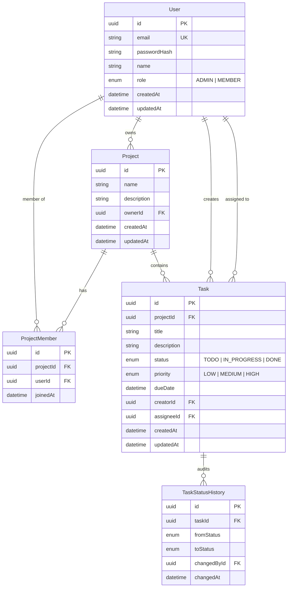

# Database Design (Prisma + Supabase Postgres)

## Overview

Supabase provides managed PostgreSQL. Prisma owns the schema and migrations.
Auth is application-level JWT (not Supabase Auth) so password hashing and roles stay in our NestJS API.

## ER Diagram

## Access rules (enforced in NestJS, not only DB)

| Action | Who |
|--------|-----|
| See project | Global `ADMIN`, or `ProjectMember` |
| Create project | Any authenticated user (creator becomes owner + member) |
| Update / delete project | Global `ADMIN`, or project `owner` |
| Add / remove members | Global `ADMIN`, or project `owner` |
| CRUD tasks in project | Global `ADMIN`, or `ProjectMember` |

## Enums

- `Role`: `ADMIN`, `MEMBER`
- `TaskStatus`: `TODO`, `IN_PROGRESS`, `DONE` (API labels: To Do / In Progress / Done)
- `TaskPriority`: `LOW`, `MEDIUM`, `HIGH`

## Indexes

- `User.email` unique
- `ProjectMember (projectId, userId)` unique
- `Task (projectId, status)`, `(projectId, priority)`, `(projectId, assigneeId)` for filters
- `Task.dueDate` for sorting later

## Why this shape

- **Global role + membership** matches “Admin and Member” plus “only projects you can access.”
- **Owner on Project** gives a clear admin for that board without a second role system.
- **`TaskStatusHistory`** is ready for the audit-log bonus; can be wired after core CRUD.
- **UUIDs** play nicely with Supabase and public APIs.
